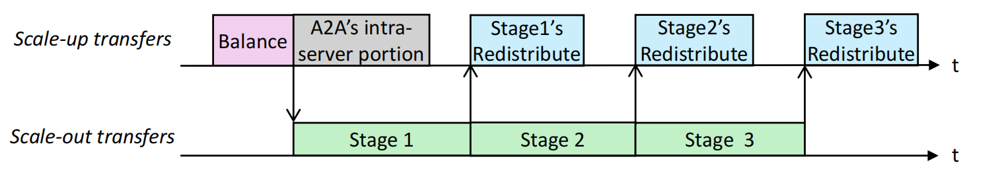

# 仿真代码设计文档

## 文件与模块映射

- `common.py` — 全局配置、数据结构、工作负载生成函数及命令行参数
- `deepEP.py` — DeepEP 策略的仿真实现
- `fast.py` — FAST 策略的仿真实现
- `workload/` — 由 `generate_workload` 生成的迭代级别请求文件（`iter_{i}_requests.pkl`）

---

## 数据结构与单位说明

- SimConfig: 集群和模型参数。：
  - 带宽（`bw_inter`, `bw_intra`）在构造中被转为 **KB/s**（GB 转为 KB: $1024*1024$）
  - `token_size` 单位为 **KB**（embed_size \* dtype_bytes / 1024）
  - `num_tokens = seq_len * batch_size`
- TokenRequest: 描述单个 token 的来源 GPU (`src_gpu`) 以及目的专家 (`target_experts`) 与目的 GPU 列表 (`target_gpus`)。
- Cluster.resolve_targets: 将 expert id 映射到 GPU id（`expert_to_gpu`）。

---

## 工作负载生成（`generate_workload`）

1. 基于 `SimConfig` 的 `num_tokens` 将 token 分配给源 GPU（尽量平均，不足部分随机分配）。
2. 每层生成 `num_tokens x top_k` 的 Zipf 分布样本并映射到专家 id，再转换为 GPU id。
3. 为每一层生成一组 `TokenRequest`，保存为 `iter_{i}_requests.pkl`（pickle）。

Zipf 分布会导致热点专家；若同一 token 的 top_k 出现重复专家，会重采样以保证目标数为 top_k。

---

## DeepEP 仿真逻辑（`DeepEPSimulator.simulate_layer`）

每个 token 按目的 GPU 的节点分组；若来源 GPU 与目标节点不同，则选择目标节点上与源 GPU 同 local rank 的 **proxy GPU** 作为跨机接收者（一次 inter），proxy 再将流量转发（intra）到目标 GPU。若在同一节点，直接做 intra 转发。

步骤：

1. 对每个 token 累计各 GPU 的 `inter_tx`/`inter_rx`、`intra_tx`/`intra_rx`（机间发送/机间接收/机内发送/机内接收，单位：**token 个数**）。
2. 找到所有 GPU 中最大的 inter 负载与 intra 负载（==计算这部分负载的时候已经考虑了聚合机制==）。
3. 计算 inter 与 intra 的时间：
   - time_inter = (max_inter_load \* token_size) / bw_inter
   - time_intra = (max_intra_load \* token_size) / bw_intra
   - ==deepEP 分发一次的总时间取二者的最大值，因为是流水线传输，分发启动后，并行开始机间传输和机内传输，机间传输大部分时间占主导，所以在这里取最大值==
4. 返回该层时间（s）及跨机流量（KB）。

假设通信可以并行进行，瓶颈由峰值负载决定。

---

## FAST 仿真逻辑（`FASTSimulator.simulate_layer`）

先统计 GPU -> GPU 的跨节点原始流量，构造 gpu 级别的通信矩阵，然后根据论文中的描述构造节点级别的矩阵，然后通过 pad 构造**节点级别的双随机矩阵**，再通过`scipy.optim.linear_sum_assignment`匈牙利匹配执行若干轮（Birkhoff decomposition）并估算三个阶段的延迟：balance（节点内均衡）、inter（跨节点传输）、redist（最后的节点内重分配）。

步骤：

1. 遍历每个 token 的目标 GPU，填充 `gpu_traffic_matrix` 和统计 `total_inter_traffic`。
2. 将 GPU 级矩阵聚合成 `node_traffic_matrix`（每对源节点/目标节点做均摊）。
3. 计算 **balance_latency**：遍历每个节点，计算 balance 通信的最大时间。
4. 通过 max(row_sums, col_sums) 得到 `max_load`，估算跨机阶段的时间：
   - inter_traffic_latency = (max_load \* token_size) / bw_inter
5. 对 node_traffic_matrix 做 padding（`_pad_matrix`）使其成为双随机矩阵，并用 `_brikhoff_decomposition` 得到阶段拆分，
6. 利用 `_find_last_stage` 找到包含真实流量的最后阶段以估算**redist_latency**==(但是这里的重分发矩阵我想不明白怎么计算，所以在这里就假设每个 GPU 接收到的跨机流量都有一半分发给了本机内其他的 GPU，做了一个比较简单的近似处理)==。
7. 三阶段时间之和即为该层总时间。理论来源是 FAST 论文的流水线设计
   

- `_pad_matrix`: 将矩阵填充为每行/列和为 `max_load` 的目标矩阵，同时返回 padding 的位置（diff）。
- `_brikhoff_decomposition`: 以匈牙利算法（linear_sum_assignment）分解为 permutation 矩阵的加权和。
- `_find_last_stage`: 从后向前找到包含真实流量的最后阶段并据此调整计算。

==假设最后 redist 阶段中每个 GPU 都有一半流量给了其他 GPU。==

---

## 指标与统计

脚本会输出：

- Total Latency（总延时，s）
- Avg Layer Latency（平均每层延时，ms）
- Total Inter-node Traffic（跨机流量，GB）
- Algorithmic Bandwidth（GB/s），计算式：

  ```
  total_payload = num_tokens * token_size * num_layers * iter_num * top_k
  algo_bw = total_payload / (total_latency * total_gpus)
  ```

---

## 运行脚本

1. 生成工作负载（在项目根目录）：

```bash
python common.py --workload_output_dir ./workload --iter_num 10 --num_nodes 4 --gpus_per_node 8 --experts_per_gpu 2
```

2. 运行 DeepEP 仿真：

```bash
python deepEP.py --workload_output_dir ./workload
```

3. 运行 FAST 仿真：

```bash
python fast.py --workload_output_dir ./workload
```
