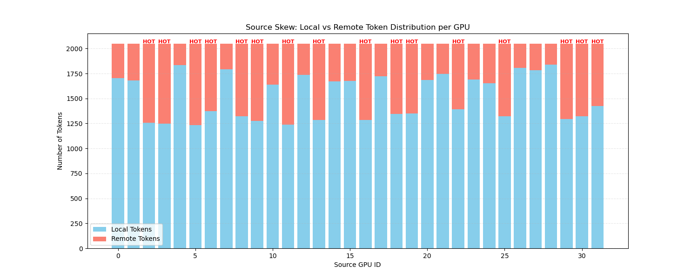
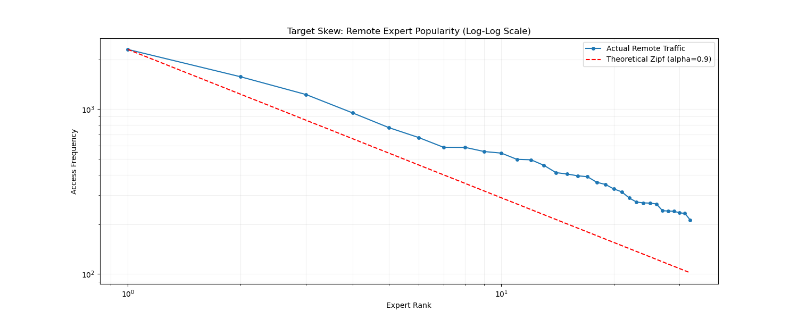

# 双偏斜负载生成

## 1. 负载生成逻辑详解

### 1.1 核心算法原理

采用双偏斜算法来生成模拟MoE训练中的复杂通信负载。该算法旨在同时模拟网络中常见的两种流量偏斜特征：

1. **源端偏斜**：发送端GPU的热点分布不均。部分GPU（Hot Ranks）产生大量跨机流量，而其他GPU（Cold Ranks）主要产生机内流量。
2. **目标端偏斜**：接收端专家的访问频率服从Zipf分布。少数热门专家接收大量请求，形成接收端热点。
   ==其实源端偏斜就会导致目标端偏斜，因为deepEP是同号卡绑定，发送端的发送负载不均衡，那么接收端必定也就不均衡==

### 1.2 参数文档说明

| 参数名              | 类型        | 默认值     | 含义与影响                                                                                                      |
| :------------------ | :---------- | :--------- | :-------------------------------------------------------------------------------------------------------------- |
| `hot_rank_ratio`    | float       | 0.5        | **节点内热点GPU比例**。 决定了每个节点有多少GPU被标记为"Hot"。比例越高，集群整体跨机流量基数越大。           |
| `hot_remote_ratio`  | list[float] | [0.4, 0.5] | **热点GPU跨机比例区间**。 Hot Rank GPU的跨机流量比例将在此区间内随机选择。值越高，热点发送端的网络压力越大。 |
| `cold_remote_ratio` | list[float] | [0.1, 0.2] | **冷点GPU跨机比例区间**。 Cold Rank GPU的跨机流量比例将在此区间内随机选择。通常设为较低值以模拟背景流量。    |
| `zipf_alpha`        | float       | (config)   | **Zipf分布参数**。 控制目标专家的热度集中程度。$\alpha$越大，流量越集中在头部专家，接收端热点越严重。        |

### 1.3 实现流程

负载生成过程主要包含以下步骤：

1. **参数校验与初始化**：
   - 验证`hot_remote_ratio`和`cold_remote_ratio`是否为合法的区间列表。
   - 检查专家数量是否满足`top_k`要求。
   - 计算每个GPU的基准Token数量，确保初始负载绝对均衡。

2. **动态配置生成（Metadata Generation）**：
   - 根据`hot_rank_ratio`计算每个节点的Hot Rank数量。
   - **随机选择Hot Ranks**：每个节点独立随机选择指定数量的GPU作为Hot Rank，模拟异构环境。
   - **随机分配Remote Ratio**：
     - Hot Rank GPU从`hot_remote_ratio`区间内随机采样一个值作为其跨机比例。
     - Cold Rank GPU从`cold_remote_ratio`区间内随机采样一个值。
   - 将所有GPU的配置信息（是否Hot、具体Ratio）保存为`workload_metadata.pkl`，用于后续分析和复现。

3. **Token请求生成**：
   - **本地Token生成**：根据计算出的`num_local`，从当前节点的专家中无放回随机选择`top_k`个作为目标。
   - **远程Token生成**：
     - 根据`num_remote(跨机token的数量)`生成跨机请求。
     - 使用预计算的全局Zipf概率向量进行批量采样。

## 2. analyze_bimodal_skew 函数分析

该函数用于验证生成的负载数据是否符合预期的分布特征。它读取生成的`.pkl`文件和`workload_metadata.pkl`元数据，生成两张关键图表。

### 2.1 图表含义

1. **Source Skew Chart (`analysis_source_skew.png`)**：
   - **展示内容**：每个GPU的本地（蓝色）与远程（红色）Token数量堆叠柱状图。
   - **标记**：根据元数据，在Hot Rank GPU上方标记红色"HOT"字样。
   - **意义**：直观展示发送端的负载不均。可以清晰看到Hot GPU的红色部分显著高于Cold GPU，且由于随机区间的存在，不同Hot GPU的红色高度也有细微差异。

2. **Target Skew Chart (`analysis_target_zipf.png`)**：
   - **展示内容**：远程专家访问频率的双对数坐标图（Log-Log Plot）。
   - **曲线**：蓝色点线为实际统计的流量分布，红色虚线为理论Zipf分布。
   - **意义**：验证目标选择是否严格服从Zipf分布。如果两条线重合度高，说明目标偏斜生成逻辑正确。

## 3. 负载特征可视化

### 3.1 源端偏斜分布 (Source Skew)

_图1：源端Token分布图。红色代表跨机流量，蓝色代表本机流量。可以看到被标记为HOT的GPU（如GPU 2,3,……）拥有显著更高的跨机流量比例，且具体比例在设定区间内随机波动，模拟了真实的异构负载场景。_

### 3.2 目标端Zipf分布 (Target Skew)

_图2：目标专家热度分布图（双对数坐标）。横轴为专家排名，纵轴为访问次数。实际流量（蓝线）紧密贴合理论Zipf分布（红虚线），证明了接收端热点生成的准确性。_
